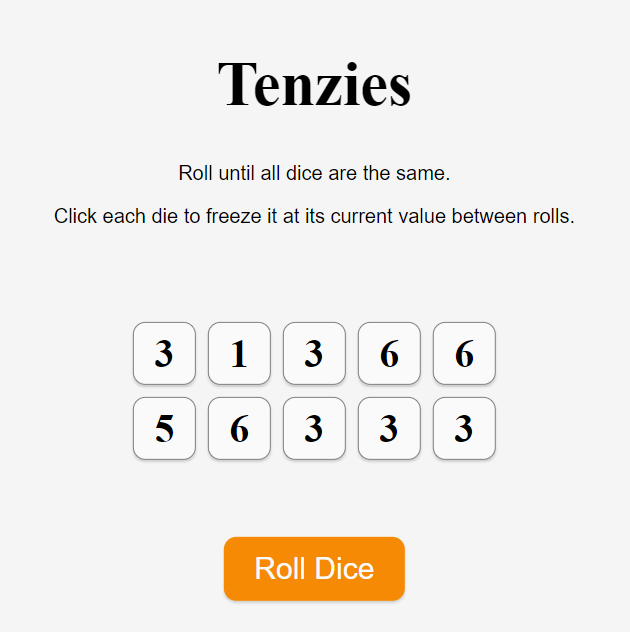
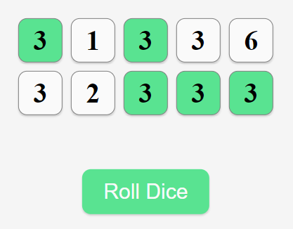
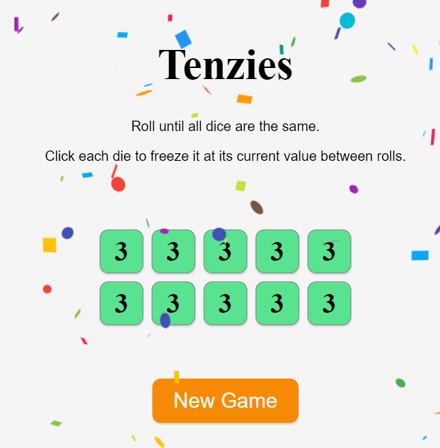

# Tenzie Dice Game
This project is a React-based web application that simulates the popular dice game called Tenzi. In this game, players roll a set of dice until all dice show the same value, achieving what is known as "Tenzies."

Check out the project [Live Site](https://silviasaverino.github.io/react-tenzie-dice-game/)

## How to Play
- Roll the Dice: Click the "Roll Dice" button to roll the dice. The values on the dice will change with each roll.

- Hold Dice: Click on individual dice to hold them at their current value. Held dice will not change their value when you roll the dice again.

- Achieve Tenzies: Keep rolling the dice and holding them until all dice show the same value. Once achieved, you win the game!

- Start a New Game: After achieving Tenzies, you can start a new game by clicking the "New Game" button.

## Features
- Dynamic dice rolling and holding functionality.
- Responsive design for optimal gameplay on various devices.
- Visual feedback with confetti when Tenzies is achieved.
- Simple and intuitive user interface.

## Code Structure

### Die Component (Die.js)
- Functionality: 
    Represents a single die in the game.
- Props:
    value: Current value of the die.
    isHeld: Indicates whether the die is held (frozen) or not.
    selectDieOnHold: Function to toggle the held status of the die.
- Styling: 
    Dynamically changes background color based on whether the die is held or not.
### Main Component (App.js)
- State Management: 
    Manages state for the dice set (newDice) and whether Tenzies is achieved (tenzies).
#### Functions:
- createNewDiceSet(): 
    Creates a new die object with a random value, unique ID, and default hold status.
- getNewDice(): 
    Generates a new set of 10 dice using createNewDiceSet().
- rollDice(): 
    Handles rolling the dice, updating their values unless they are held. Starts a new game if Tenzies is achieved.
- selectDieOnHold(): 
    Toggles the held status of a die based on its ID.
#### Effects:
- useEffect(): 
    Monitors changes to the dice set and checks if Tenzies is achieved. Sets the tenzies state to true if all dice are held and have the same value.
### Styling
CSS file (App.css) contains styling for the game layout, dice appearance, buttons, and responsiveness.